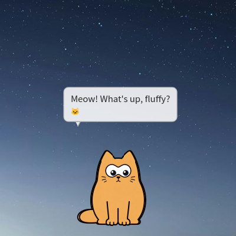
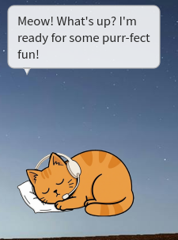
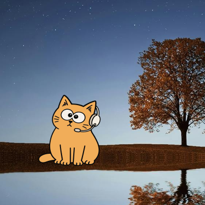
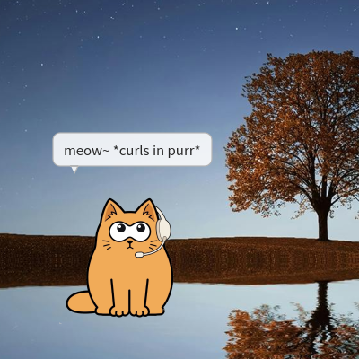
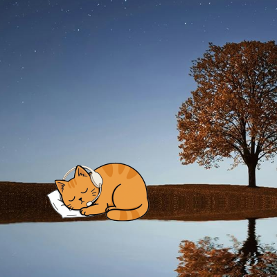
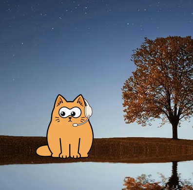

EN | [RU](https://github.com/yumiaura/myCat/blob/main/docs/README_RU.md) | [CN](https://github.com/yumiaura/myCat/blob/main/docs/README_CN.md) | [ID](https://github.com/yumiaura/myCat/blob/main/docs/README_ID.md) | [KO](https://github.com/yumiaura/myCat/blob/main/docs/README_KO.md)

## Desktop Cat: QT Overlay 🐱

[](https://github.com/yumiaura)

<p class="badges">
  <a href="https://github.com/yumiaura/myCat/releases/latest"></a>
  
  <a href="https://pypi.org/project/mycat/"></a>
  <a href="https://pypi.org/project/mycat/"></a>
</p>

I made a cute little animated cat 🐈 for your desktop, with an interface in English, 中文, 한국어 and Русский.<br>
It's a lightweight Python + Qt app - no borders, and you can drag it around easily.<br>
Shows static first frame for 5 seconds, then plays GIF animation once, then loops back to static.<br>
Switch the interface language any time under **Settings → Language**.<br>
If you like it, maybe I'll share an [AnimeGirl](https://github.com/yumiaura/mycat/discussions/1) version next time~ 😉<br>


### LLM Chat, Reminders, GitHub Integration & Tracking Activity


<br />


### 🎨 Create your own cat with AI

Turn a few photos into your own cat. Right-click → **Chars → Create custom with AI…**,
add 1–3 photos of the same person, **edit the prompt** (and a negative prompt for the
self-hosted backends) to shape the character, pick **txt2img** (from the prompt) or
**img2img** (from your photos), and generate with **OpenAI** or your own self-hosted
**Stable Diffusion (AUTOMATIC1111)** or
**ComfyUI** server — set its address in the dialog and pick the checkpoint from the live
model list. It's saved as an ordinary local char you can reuse or delete anytime; reference
photos are resized in memory and **never stored** by myCat. OpenAI needs your own API key
(one request per generation) and returns a transparent cat; the self-hosted backends run on
your own GPU.


<br />


## 🚀 Quick start

Pick whichever is easiest - the cat runs on **Windows, macOS and Linux**.

### Option A - prebuilt binary (no Python needed)

Grab the build for your OS - each button downloads the **latest release**:

<p>
  <a href="https://github.com/yumiaura/myCat/releases/latest/download/mycat-windows-x64.exe"></a>
  <br>
  <a href="https://github.com/yumiaura/myCat/releases/latest/download/mycat-macos-arm64.zip"></a>
  <br>
  <a href="https://github.com/yumiaura/myCat/releases/latest/download/mycat-macos-x64.zip"></a>
  <br>
  <a href="https://github.com/yumiaura/myCat/releases/latest/download/mycat-linux-amd64.deb"></a>
  <br>
  <a href="https://github.com/yumiaura/myCat/releases/latest/download/mycat-linux-x86_64.AppImage"></a>
</p>

Then run it:

- **Windows** - double-click the `.exe`.
- **macOS** - unzip and open `mycat.app` (first launch: right-click → **Open** to get past Gatekeeper).
- **Linux `.deb`** - `sudo apt install ./mycat-linux-amd64.deb`.
- **Linux AppImage** - `chmod +x mycat-linux-x86_64.AppImage && ./mycat-linux-x86_64.AppImage` (needs FUSE: `sudo apt install libfuse2`).

> Builds for every release live on the **[Releases](https://github.com/yumiaura/myCat/releases)** page.

### Option B - pip (Windows / macOS / Linux, Python ≥ 3.10)

```bash
pip install mycat
mycat
```

On **Linux** also install the Qt platform plugin once:

```bash
sudo apt install -y libxcb-cursor0
```

The activity diary can **count** key presses and clicks (never _which_ keys) -
it works out of the box on Windows, macOS and Linux/X11. Where global input
access isn't available (e.g. Wayland) it degrades to recording the cursor path.

Upgrade or remove later with `pip install -U mycat` / `pip uninstall mycat`.

### Option C - from source

```bash
git clone https://github.com/yumiaura/myCat
cd myCat
pip install .
mycat                 # or, without installing:  python3 mycat/main.py
```

## ✨ Features

- **Animated overlay** 🐱 - a frameless, always-on-top, draggable cat. Right-click for the menu (switch char, quit).
- **Reminder** 🛩️ - set a message and a time (one-shot or daily) and the cat flies a little banner plane across the top of your screen. Right-click → _Reminder…_ to set the message, direction, plane and color.
- **Chat (Ollama)** 💬 - talk to the cat through a **local [Ollama](https://ollama.com) model**, no account or API key needed (see below).
- **Create with AI** 🎨 - turn 1–3 photos into a custom chibi cat character with your own OpenAI key (right-click → _Chars → Create custom with AI…_). Reference photos are never stored; the result is an ordinary local char you can reuse or delete.
- **Multilingual interface** 🌐 — the whole UI is available in **English, 한국어 (Korean), Русский (Russian) and 简体中文 (Simplified Chinese)**. Right-click the cat (or the tray) → under **Settings…** → **Language** to switch at any time; the choice is remembered. Translations live in plain `mycat/locale/*.json` files, so adding a language is just dropping in a file.

## 💬 Chat with the cat (Ollama)

The cat can chat using a model served locally by [Ollama](https://ollama.com) - everything stays on your machine, no API key required.

1. Install [Ollama](https://ollama.com) and pull a model:
   ```bash
   ollama pull llama3.1
   ```
2. Launch **mycat**, then right-click the cat → **Ollama…**
3. Set the host/port (default `localhost:11434`), click **Load models**, pick one, hit **Test**, then **Save** and tick **LLM enabled**.
4. Right-click → **Chat** to start talking. 🐾

## 🎮 Usage & options

Run `mycat` (or `python3 mycat/main.py` from source) and customise it with command-line options.

**`--image, -i <path>`** 🖼️ - use a custom ZIP archive (containing one GIF) instead of the default cat:

```bash
mycat --image ~/my-custom-cat.zip
```

A char **ZIP** must contain exactly one `.gif`: its first frame is the static pose, then the GIF plays once and returns to that frame. Images larger than 300×500 are scaled down automatically.

**`--pos <x> <y>`** 📍 - start at a specific screen position (otherwise the cat appears bottom-right and remembers where you last dragged it):

```bash
mycat --pos 960 540        # center of a 1920x1080 screen
```

**`--wait <seconds>`** ⏱️ - how long to hold the static first frame before the animation plays.

**`--debug`** 🐞 - verbose per-frame logging.

### Controls

- **Left-drag** the cat to move it.
- **Right-click** the cat for the menu (Chars, Reminder…, Ollama…, Chat, Quit).
- **Quit** from the menu or with Ctrl+C in the terminal.

The cat remembers its position and selected char between sessions in `~/.config/mycat/config.ini`.

## 🎬 Make your own cat

A char is just an animated GIF in a `.zip` - from a quick doodle to a fully
interactive cat with cursor-tracking eyes, blinking, sleeping and click
reactions. Step-by-step guide (draw it, build the GIF, package, install & share):
**[docs/CHARS.md](docs/CHARS.md)**.

## 🐳 Docker

Run the cat in a container with GUI forwarding to your host's X server.

**Prerequisites:** Docker, and an X server on the host (Xorg on Linux, VcXsrv on Windows, XQuartz on macOS).

```bash
# Linux
xhost +local:docker
docker compose up --build

# Windows (VcXsrv running, network clients allowed)
docker compose -f docker-compose.windows.yml up

# macOS (XQuartz running, network clients allowed)
docker compose -f docker-compose.mac.yml up
```

## 🔧 Troubleshooting

**Cat appears in a black box / transparency doesn't work** 🫥

- On X11 transparency needs a compositor. mycat falls back to clipping the window to the cat's outline when none is running, so this is rare; if you still see a box, enable display compositing (XFCE: _Window Manager Tweaks → Compositor_) or run a compositor such as `picom`.

**Window doesn't stay on top / doesn't show in the taskbar** 📌

- Some window managers override "always on top" - restart the desktop session or check the WM settings.

**Custom char doesn't load** ❌

- The ZIP must contain exactly one valid `.gif`. Check the path and that the file isn't corrupted.

**Position not saving** 💾

- Make sure `~/.config/mycat/` exists and is writable; the config file is `~/.config/mycat/config.ini`.

**Windows / launch issues** 🪟

- Need Python ≥ 3.10 (`python --version`) for the pip install, or just use the prebuilt `.exe`.
- From the repo you can also launch with `run.bat` (Windows) or `run.sh` (Linux/macOS).
- Verify PySide6: `python -c "import PySide6; print('PySide6 OK')"`.

**Permission errors** 🔒

- On Linux prefer a user install over `sudo` (`pip install --user mycat`).

### 🤝 Getting help

- Search the [GitHub Issues](https://github.com/yumiaura/myCat/issues) for similar problems.
- Read [CONTRIBUTING.md](CONTRIBUTING.md) for development setup.
- Open a new issue with your OS, desktop environment, Python version and any terminal errors.

### License

[MIT License](LICENSE.txt)

Thank you for reading to the end! 😸🐾

<p class="badges">
  <a href="https://buymeacoffee.com/yumiaura"></a>
  <a href="https://www.patreon.com/yumiaura"></a>
</p>

---


name: 'README.md'
description: 'myCat Desktop Pet — QT Overlay'
created_date: '2026/05/01'
modified_date: '2026/08/21'
project_version: '0.2.6'
document_version: '1.0.1'
agent_sign: ['human/mimas', 'opencode/current']
---

# myCat Voice Assistant Fork

這個分支為 myCat 加入本機端語音助理功能。

---

## 🎙️ Voice Assistant (myCat + Voice)

 

> **🧪 實驗性功能：本機端語音助理**
> 我們為 myCat 打造了本機端語音助理：用語音 VAD 偵測喚醒貓咪，並用語音下達指令
> （透過 faster-whisper 轉寫）。多執行緒架構 (QThread 整合) 保證貓咪動畫在您說話時依然滑順不卡頓。
>
> 已實作 `cat2` 角色包的語音反應（需自備 Ollama + faster-whisper）：
>
> - 👂 **聆聽 (listen.png)** — VAD 觸發時覆蓋貓臉，顯示聆聽姿態
> - 🤔 **思考 (think.png)** — ASR 轉寫中，貓咪歪頭等待
> - 🥱 **打哈欠 (yawn.png)** — 語音靜默 30 秒後自動觸發（可設定、可關閉）
> - 💬 **氣泡回覆** — Ollama 回應以浮動氣泡顯示：X11/Sway 為獨立 xdg_popup 視窗；GNOME 等 Wayland 環境自動改用視窗內繪製，同樣不受平鋪管理限制
> - 😺 **表情疊圖修復** — 語音 overlay 活躍時自動隱藏靜態臉與瞳孔，不疊圖
> - 🎤 **輸入裝置自動偵測** — 啟動時自動選擇 PulseAudio/PipeWire，支援 GUI 手動切換
> - ⚡ **ASR 暖啟動** — 啟動時預載模型，SLEEP 時釋放記憶體
>
> **啟用方式**：
>
> ```bash
> pip install "mycat[voice]"     # 語音依賴：pyaudio + faster-whisper
> ollama pull llama3.1           # 對話模型（見上方 Chat 段落）
> ```
>
> 選項集中在 `mycat/voice_assistant/config.yaml`：`audio.device_index`（null=自動偵測）、
> `asr.model_size` / `asr.language`、`overlay.idle_yawn_after`（打哈欠閾值秒數，0 關閉）等。
>
> **實機畫面預覽：**
>
>  
>  
> 
>
> 由左至右、由上至下：🤔 ASR 轉寫思考 → 💬 Ollama 氣泡回覆 → 🥱 靜默 30 秒打哈欠 → 😴 入睡 → 😺 一般待機。
