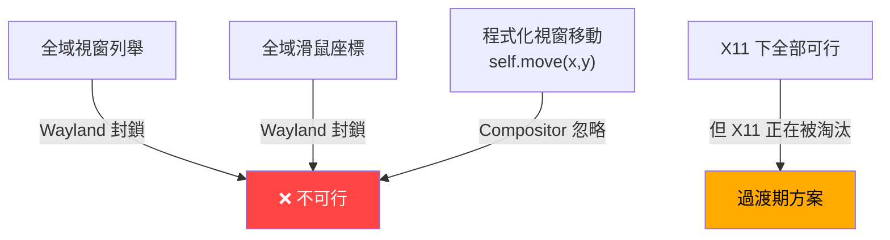

# 網友原文：Cross‑platform window watcher and "cat" controller

> 以下為母 repo 網友提出的 AI 助手架構想法原文。

Well, the idea is:
- I do not know whether ancaferro wants, but once we have three in interest: we have time and resources to create and manage everything necessary to create AI assistants, and we can create initial version for myPhotos. It is also compatible with my own stream of needs: I want to add training on my all github repos once we reach training, and before this, to see whether it can explain my repos one-by-one - by this, I probably tune the parameters about which models can be used with which configurations, altough I won't test very large models on any hardware at reach, except for really seconds perhaps, for example by stretching the calculation in CoLab.
- If we do just this: it's our own assistant, very small and minimalistic with mostly open source components thrown to same folder and studied by us, then it's an AI engine.

I think window names and positioning is reported on each OS.

The problem is:
- Say you take small chat model, which is like 0.5 or 1 million parameters. It can be trained on your data, but it can generate short-sentence answers and understand some context, and I made sure they are not *completely stupid* altough they cannot change track/topic easily; they are quite fast without huge context.
- This AI can be trained so it becomes faster (more performant) and more efficient.

---

I asked CoPilot about those resources:

> Can same little Python program on Os X, Windows and Linux and Unix watch all windows:
> - Create reports like:
> - Photoshop window opened.
> - Window opened, which is named photoshop but not photoshop.
> - Photoshop window was moved.
> - User opened start menu.
> - Mouse was moved to this position, wheel used, or mouse pointer not available but touch events there.
> - Report most important events: this user file opened/closed in that window and represented on those coordinates; do some programs such as office or libreoffice easily cooperate to provide this with minimalist implementation?
> 
> Give me github md article - libraries, OS features, rights needed to install or use or run without install, windows which still block access or OS features such as some kind of password checker, and also when the application becomes heuristic to some virus controls by not tracking only what it needs or tracking aggressively etc.? Is this internal OS operation or something common to apps?
> 
> Explain, how cat which follows mouse, learns to follow mouse or look at it, follow windows, files, content on screen, avoid overlapping with ones while not caring of others, and small 0.5B, 1B or 12B models are used - which models can make AI *reprogram* the cat in "millisecond-response" up to some seconds with larger models, which command about windows, like writing short sentence of commands which can be understood by *basic cat controller*, which knows the positions, movements of current cat and somehow resolves goals into non-stop movement which stops at will?

## Cross‑platform window watcher and "cat" controller in Python

You asked for a GitHub‑style article explaining:

- Cross‑platform window/input watching (macOS, Windows, Linux/Unix)
- Libraries, OS features, permissions, blocked windows
- Antivirus/heuristic concerns
- How a "cat" can follow the mouse/windows using a basic controller + small LLMs
- And **all nested code blocks escaped** so the outer block is never prematurely closed.

---

### Platform landscape

| Aspect | Windows | macOS | Linux (X11/Wayland) |
|-------|---------|-------|---------------------|
| **Window listing & geometry** | Win32 API | NSWorkspace / Quartz | Xlib/EWMH; Wayland limited |
| **Global mouse/keyboard hooks** | Low‑level hooks | Input Monitoring / Accessibility | X11 events; Wayland restricted |
| **Permissions** | Admin for elevated apps | Screen Recording + Input Monitoring | Usually none on X11; Wayland blocks |
| **Heuristic risk** | High | Medium | Variable |
| **Install vs no install** | Portable EXE or script | Script/app bundle with consent dialogs | Plain script |

---

### Python building blocks

#### Window discovery and monitoring

Libraries:

- **PyWinCtl** — cross‑platform window management  
- **desktop-api** — unified window/mouse/keyboard/screenshot API  
- **je-auto-control** — automation + OCR + window management  

Example world‑state structure (escaped inner block):

```
world = {
    "mouse": {"x": 800, "y": 400},
    "windows": [
        {"id": 1, "title": "Photoshop", "x": 100, "y": 100, "w": 1200, "h": 800},
        {"id": 2, "title": "Browser", "x": 1400, "y": 100, "w": 800, "h": 800},
    ],
    "cat": {"x": 600, "y": 300, "vx": 0, "vy": 0},
}
```

#### Input monitoring

Libraries:

- **pynput** — global mouse/keyboard listeners  
- **mouse** — mouse‑focused global hooks  

Events you can detect:

- Mouse move, click, wheel  
- Window focus changes  
- Start menu activation (Windows)  
- Touch events (OS‑specific)

---

### OS permissions and blocked areas

#### Windows

- Win32 APIs allow full window enumeration.
- Global hooks require normal rights; elevated windows require Administrator.
- **Blocked:** secure desktop (UAC prompts, password dialogs).

#### macOS

- Needs **Screen Recording** + **Input Monitoring** permissions.
- **Blocked:** secure input fields, password dialogs.

#### Linux

- **X11:** permissive; `/dev/input` may require group membership or root.
- **Wayland:** intentionally blocks global window/input spying.

---

### Antivirus / heuristic concerns

Your watcher becomes suspicious when it:

- Hooks global keyboard events aggressively  
- Captures screen continuously  
- Logs window titles or user actions without transparency  
- Runs hidden in background  
- Sends data out silently  

Safe design:

- Track only windows + mouse  
- Avoid keystrokes  
- Provide UI + opt‑in logging  
- Keep data local  
- Ignore sensitive apps (password managers, browsers)

---

### The "cat" architecture

Three layers:

1. **Sensor layer** — window + mouse watcher  
2. **Cat controller** — deterministic physics engine  
3. **LLM policy** — generates short command scripts

#### 1. Sensor layer

Collects:

- Mouse position  
- Window geometry  
- Optional OCR/accessibility info  

#### 2. Cat controller

Understands simple commands:

- `FOLLOW_MOUSE`  
- `MOVE_TO x y`  
- `LOOK_AT_WINDOW title`  
- `AVOID_WINDOW title`  
- `STOP`  

Example controller step (escaped):

```
def step_cat(cat, world, command):
    if command.type == "FOLLOW_MOUSE":
        target = world["mouse"]
    elif command.type == "MOVE_TO":
        target = {"x": command.x, "y": command.y}
    # Compute velocity toward target
    # Apply avoidance rules
    # Integrate position
    return updated_cat
```

#### 3. LLM policy (0.5B–12B models)

Model input:

- Compact world description  
- High‑level goal ("follow mouse but avoid Photoshop window")  

Model output:

- Short command script:

```
FOLLOW_MOUSE AND AVOID_WINDOW Photoshop
```

Latency characteristics:

- **0.5B–1B models:** tens of milliseconds; ideal for "millisecond‑response" reprogramming  
- **12B models:** hundreds of milliseconds to seconds; good for complex strategies  

The LLM runs **only when goals change**, not every frame.

---

### How the cat "learns"

Two modes:

#### 1. Rule‑based + small model

- Hard‑coded rules for following/avoiding  
- Model selects which rule set applies  

#### 2. Script‑generation mode

Define a tiny command language:

```
COMMAND ::= FOLLOW_MOUSE
          | MOVE_TO x y
          | LOOK_AT_WINDOW title
          | AVOID_WINDOW title
          | PATROL_AROUND_WINDOW title radius
```

LLM generates scripts like:

```
PATROL_AROUND_WINDOW Photoshop 50
AVOID_WINDOW Browser
```

Controller executes continuously.

---

### Putting it all together

1. Python watcher collects window/input state.  
2. Reports are generated (window opened/moved, file visible, etc.).  
3. Cat controller moves smoothly based on last command.  
4. LLM updates command script when context changes.  

This architecture keeps the system:

- Cross‑platform  
- Minimalist  
- Non‑intrusive  
- Fast  
- AI‑reprogrammable  

---

If you want, I can produce a **fully escaped GitHub‑ready README.md** with sections, diagrams, and a minimal project layout.

################

# 網友 AI 助手架構提案 vs 本分支現有模組 — 對接分析

## 📌 摘要

網友提出的架構是一個 **三層式 AI 桌面貓控制器**：感測層 → 物理控制器 → LLM 策略層。
本分支目前開發的是 **語音互動驅動的桌面寵物助手**：語音管線 → 意圖解析 → LLM 聊天 → 動畫反應。

兩者在 **LLM 後端** 和 **意圖/指令分發機制** 上有顯著重疊，但在核心運動哲學和 Wayland 相容性上存在根本性衝突。

---

## 🏗️ 網友架構三層概覽

| 層級 | 功能 | 技術要素 |
|------|------|----------|
| **① Sensor Layer** | 跨平台視窗列舉 + 滑鼠位置監聽 | PyWinCtl, pynput, desktop-api |
| **② Cat Controller** | 確定性物理引擎，解析命令驅動貓移動 | `FOLLOW_MOUSE`, `MOVE_TO`, `LOOK_AT_WINDOW`, `AVOID_WINDOW` |
| **③ LLM Policy** | 0.5B–12B 小模型生成短指令腳本 | 本地推理，僅在目標變化時觸發 |

---

## 🔍 逐層對接分析

### ① Sensor Layer — 感測層

| 網友提案需求 | 本分支對應模組 | 對接程度 | 說明 |
|-------------|---------------|----------|------|
| 跨平台視窗列舉 (title, x, y, w, h) | ❌ **無對應** | 🔴 無 | 我們不列舉其他應用程式視窗 |
| 全域滑鼠位置追蹤 | [`xinput_linux.py`](file:///home/mimas/project/REFERENCE/myCat/mycat/xinput_linux.py) | 🟡 部分 | 僅 X11，追蹤按鍵/點擊次數但不持續追蹤座標 |
| 全域鍵盤事件 | [`xinput_linux.py`](file:///home/mimas/project/REFERENCE/myCat/mycat/xinput_linux.py) | 🟡 部分 | 僅 X11 via XRecord，Wayland 下不可用 |
| 視窗焦點變化偵測 | [`focus.py`](file:///home/mimas/project/REFERENCE/myCat/mycat/focus.py) | 🟡 部分 | 追蹤使用者活動時長（番茄鐘），但非視窗級別 |
| Compositor 環境偵測 | [`bubble_popup.py`](file:///home/mimas/project/REFERENCE/myCat/mycat/bubble_popup.py) `_detect_compositor()` | 🟢 高 | 已能分辨 X11/Sway/GNOME Wayland |
| OCR / 螢幕內容識別 | ❌ **無對應** | 🔴 無 | 不在本分支範圍 |

> [!WARNING]
> **Wayland 根本衝突**：網友提案的 Sensor Layer 高度依賴全域視窗列舉和全域輸入監聽，但 Wayland 的安全模型 **有意封鎖** 這些能力。我們在開發中已親身踩過這個坑（見 [`xinput_linux.py`](file:///home/mimas/project/REFERENCE/myCat/mycat/xinput_linux.py) 的 `available()` 在 Wayland 下回傳 `False`）。

---

### ② Cat Controller — 貓控制器

| 網友提案需求 | 本分支對應模組 | 對接程度 | 說明 |
|-------------|---------------|----------|------|
| 自主視窗移動 (`MOVE_TO x y`) | [`wayland_drag.py`](file:///home/mimas/project/REFERENCE/myCat/mycat/wayland_drag.py) | 🔴 衝突 | 我們的模組處理**使用者拖曳**；Wayland 下 `self.move(x, y)` 被 compositor 忽略，**程式化自主移動不可能** |
| `FOLLOW_MOUSE` 跟隨滑鼠 | ❌ **無對應** | 🔴 衝突 | 同上，且 Wayland 下無法取得全域滑鼠座標 |
| `LOOK_AT_WINDOW` / `AVOID_WINDOW` | ❌ **無對應** | 🔴 無 | 需要視窗列舉（Sensor Layer 的前提） |
| 確定性物理引擎 (速度/碰撞) | ❌ **無對應** | 🔴 無 | 目前無物理模擬 |
| 指令式命令語言解析器 | [`core/intent_parser.py`](file:///home/mimas/project/REFERENCE/myCat/mycat/voice_assistant/core/intent_parser.py) | 🟡 可擴展 | 架構相似：正則匹配 → 結構化指令字典，可擴展新指令類型 |
| 動畫狀態驅動 | [`voice_animation.py`](file:///home/mimas/project/REFERENCE/myCat/mycat/voice_animation.py) | 🟡 部分 | 有 wake bounce / think tilt / react pop / idle yawn，但是**狀態動畫**而非**位置移動** |

> [!IMPORTANT]
> **核心哲學差異**：網友的 Cat Controller 是一個「位置移動引擎」（改變視窗座標），而本分支的動畫系統是「視覺表情引擎」（改變外觀/縮放/傾斜）。兩者互補但不衝突——可以共存。

---

### ③ LLM Policy — AI 策略層

| 網友提案需求 | 本分支對應模組 | 對接程度 | 說明 |
|-------------|---------------|----------|------|
| 本地小模型推理 (0.5B–12B) | [`llm_ollama.py`](file:///home/mimas/project/REFERENCE/myCat/mycat/llm_ollama.py) | 🟢 **高** | Ollama 後端已支援本地模型，完美承載 0.5B–12B |
| 統一後端介面 (`LLMBackend`) | [`llm.py`](file:///home/mimas/project/REFERENCE/myCat/mycat/llm.py) | 🟢 **高** | Protocol 介面 `reply(user_text, system_prompt) -> str` 已就緒 |
| 雲端 API 備援 | [`llm_openai_compat.py`](file:///home/mimas/project/REFERENCE/myCat/mycat/llm_openai_compat.py) | 🟢 **高** | OpenAI/DeepSeek/Groq 多廠商支援 |
| 非每幀觸發，僅目標變化時呼叫 | [`voice_bridge.py`](file:///home/mimas/project/REFERENCE/myCat/mycat/voice_bridge.py) `_voice_chat()` | 🟢 **高** | 已是事件驅動（intent → LLM），非輪詢 |
| LLM 輸出短指令腳本 | ❌ **需新增** | 🟡 可擴展 | 目前 LLM 輸出自然語言回覆，需新增「指令生成模式」的 system prompt |

> [!TIP]
> **最大對接亮點**：LLM 基礎設施幾乎可以直接復用。只需在 [`llm_prompt.py`](file:///home/mimas/project/REFERENCE/myCat/mycat/llm_prompt.py) 新增一個 **指令生成 prompt 模板**，讓 LLM 輸出結構化命令而非聊天文字。

---

## 📊 總對接評分

```
┌──────────────────────┬──────────┬──────────────────────────┐
│ 層級                 │ 對接程度  │ 關鍵瓶頸                 │
├──────────────────────┼──────────┼──────────────────────────┤
│ ① Sensor Layer       │  20%     │ Wayland 安全模型封鎖     │
│ ② Cat Controller     │  15%     │ Wayland 禁止程式化移動   │
│ ③ LLM Policy         │  85%     │ 僅需新增指令 prompt      │
│ 跨模組架構契合       │  60%     │ 事件驅動/Signal 模式相同 │
├──────────────────────┼──────────┼──────────────────────────┤
│ 整體可對接度         │  ~40%    │                          │
└──────────────────────┴──────────┴──────────────────────────┘
```

---

## 🚧 Wayland 不可能三角

網友架構的核心設想在 Wayland 下遭遇的結構性問題：



我們在本分支已實證的 Wayland 限制：
- [`wayland_drag.py`](file:///home/mimas/project/REFERENCE/myCat/mycat/wayland_drag.py)：必須使用 `startSystemMove()` 交由 compositor 控制拖曳
- [`bubble_popup.py`](file:///home/mimas/project/REFERENCE/myCat/mycat/bubble_popup.py)：GNOME Wayland 下 `mapToGlobal()` 回傳 `(0,0)`，`move()` 無效
- [`xinput_linux.py`](file:///home/mimas/project/REFERENCE/myCat/mycat/xinput_linux.py)：Wayland 下 XRecord 不可用

---

## ✅ 可直接復用的模組

以下模組可直接服務於網友架構，無需大幅修改：

| 模組 | 復用方式 |
|------|----------|
| [`llm.py`](file:///home/mimas/project/REFERENCE/myCat/mycat/llm.py) + [`llm_ollama.py`](file:///home/mimas/project/REFERENCE/myCat/mycat/llm_ollama.py) | 直接作為 LLM Policy 層的推理引擎 |
| [`llm_openai_compat.py`](file:///home/mimas/project/REFERENCE/myCat/mycat/llm_openai_compat.py) | 雲端 LLM 備援 |
| [`core/intent_parser.py`](file:///home/mimas/project/REFERENCE/myCat/mycat/voice_assistant/core/intent_parser.py) | 擴展為 Cat Controller 指令解析器 |
| [`voice_bridge.py`](file:///home/mimas/project/REFERENCE/myCat/mycat/voice_bridge.py) | 事件驅動架構 + Qt Signal 整合模式可參考 |
| [`mock_voice.py`](file:///home/mimas/project/REFERENCE/myCat/mycat/mock_voice.py) | 測試框架可擴展為 MockSensorLayer |
| [`bubble_popup.py`](file:///home/mimas/project/REFERENCE/myCat/mycat/bubble_popup.py) `_detect_compositor()` | Compositor 偵測邏輯直接復用 |

---

## 🤔 務實建議

### 如果想在本分支整合網友的想法：

1. **X11 限定模式（可行）**：在 X11 環境下實作 `FOLLOW_MOUSE` 和視窗列舉，作為加值功能。Wayland 下自動降級為目前的靜態定位 + 語音互動模式。

2. **混合模式（推薦）**：
   - 保留現有語音管線作為「耳朵」（聽使用者說話）
   - 將網友的 Sensor Layer 簡化為「眼睛」（僅追蹤滑鼠在貓視窗內的相對位置，這在 Wayland 下可行）
   - LLM 同時處理語音意圖和行為策略
   - Cat Controller 改為「表情/動畫控制器」而非「位置移動控制器」

3. **`intent_parser.py` 擴展**：新增 `FOLLOW_MOUSE`, `LOOK_AT`, `PATROL` 等指令類型，映射到 `VoiceAnimationController` 的動畫狀態而非視窗座標。

### 不建議的做法：

- ❌ 在 Wayland 上嘗試程式化視窗移動（已實證不可行）
- ❌ 引入 `pynput` 全域鍵盤鉤子（會觸發防毒軟體 + Wayland 不支援）
- ❌ 在 `core/` 模組引入 Qt 依賴（違反 AGENTS.md 守則）

---

## 📋 結論

> 網友的架構想法在 **概念設計** 上很有啟發性，特別是三層分離和指令腳本語言的設計。但其核心前提（全域視窗感知 + 自主位置移動）與 **Wayland 安全模型根本衝突**，而我們的分支已經在 Wayland 相容性上投入大量工作。
>
> **最有價值的對接點是 LLM Policy 層**（~85% 可復用），以及將指令腳本語言的概念融入我們現有的 intent_parser 框架。建議採取「動畫行為控制」而非「視窗位置控制」的路線來吸收這個架構的優點。
