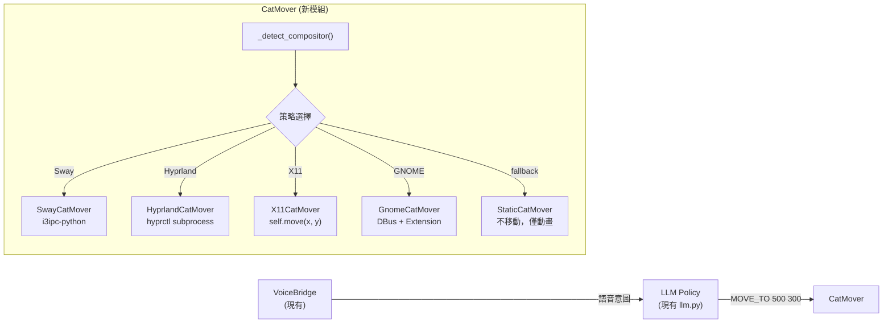

# 技術分析：Wayland 下「代理拖曳」繞道方案

## 🎯 核心問題

> 能否用一個代理來假裝是使用者在拖曳視窗，達到程式化移動效果？

**短答案**：模擬使用者拖曳 ❌ 不可行，但 Compositor IPC 直接移動 ✅ 可行（特定 compositor 限定）。

---

## 四條技術路線分析

### 路線 A：ydotool + startSystemMove() 假拖曳

**構想**：用 `ydotool`（透過 `/dev/uinput` 注入核心層輸入事件）模擬滑鼠按下 → 觸發 `startSystemMove()` → `ydotool` 移動滑鼠 → 釋放

**為什麼不行**：

```
使用者按下滑鼠 ──→ compositor 收到 pointer grab
                      ↓
              startSystemMove() ──→ compositor 接管拖曳
                      ↓
              compositor 跟隨真實指標移動視窗
                      ↓
              使用者放開 ──→ 拖曳結束
```

問題在第一步：

1. **`startSystemMove()` 需要合法的 input serial**：Wayland compositor 驗證「這個 move 請求是否來自真實的使用者互動事件」。`ydotool` 注入的事件雖然在核心層是「真實的」，但 `startSystemMove()` 必須在 **Qt 的 `mousePressEvent` 處理鏈** 中被呼叫，時序耦合極緊。

2. **控制權問題**：一旦 `startSystemMove()` 成功，compositor **完全接管**指標。你的程式失去對視窗位置的控制——視窗跟著真實滑鼠游標走，而不是你想要的目標座標。

3. **使用者體驗災難**：使用者會看到滑鼠游標被「劫持」，貓黏著游標跑，直到模擬釋放。

> [!CAUTION]
> **結論：路線 A 不可行。** `ydotool` 能注入輸入事件，但無法控制 compositor 接管後的視窗目標位置。而且會搶走使用者的滑鼠控制權。

---

### 路線 B：Compositor IPC 直接移動 ⭐ 推薦

**構想**：不模擬拖曳，直接透過 compositor 的 IPC 通道命令它移動視窗。

#### Sway（我們主要的 Wayland 環境）

```bash
# 先設為 floating，再移動到絕對座標
swaymsg '[app_id="mycat"] floating enable'
swaymsg '[app_id="mycat"] move absolute position 500 300'
```

- ✅ 精確控制 X/Y 座標
- ✅ 不影響使用者滑鼠
- ✅ 可用 `i3ipc-python` 庫從 Python 直接呼叫
- ⚠️ 視窗必須處於 **floating** 模式（桌面寵物本來就是 floating）

#### Hyprland

```bash
# 移動當前活動視窗到精確座標
hyprctl dispatch moveactive exact 500 300

# 或移動特定視窗
hyprctl dispatch movewindowpixel exact 500 300,address:0x...
```

- ✅ 同樣精確
- ✅ 支援非活動視窗移動

#### GNOME Wayland（最困難）

GNOME 沒有原生 CLI 工具，需要：

1. 安裝 GNOME Shell Extension（如 `Window Calls` 或 `ws-dbus`）
2. Extension 內部透過 `MetaWindow.move_resize_frame()` 移動
3. 外部程式透過 DBus 呼叫 Extension

```bash
# 透過 Window Calls extension 的 DBus 介面
gdbus call --session \
  --dest org.gnome.Shell \
  --object-path /org/gnome/Shell/Extensions/WindowCalls \
  --method org.gnome.Shell.Extensions.WindowCalls.MoveResize \
  <window_id> 500 300 200 200
```

- ⚠️ 依賴使用者安裝 Extension
- ⚠️ Extension API 跨 GNOME 版本不穩定
- ❌ 我們已知 GNOME Wayland 問題最多（`mapToGlobal` = `(0,0)`）

#### KDE Plasma

```bash
# KWin 腳本 或 DBus
qdbus org.kde.KWin /KWin org.kde.KWin.setWindowGeometry <id> 500 300 200 200
```

> [!TIP]
> **結論：路線 B 是唯一務實的方案。** 但必須按 compositor 分策略實作。我們的 `_detect_compositor()` 已能偵測環境，可以直接復用。

---

### 路線 C：wlr-layer-shell 圖層方案

**構想**：不用 `xdg_toplevel`（普通視窗），改用 `wlr-layer-shell` 協定把貓渲染為螢幕覆蓋層。

```
wlr-layer-shell 允許：
✅ 指定精確的螢幕座標（margins + anchor）
✅ 不受 compositor 視窗管理限制
✅ 永遠浮在最上層（或最下層）
```

**問題**：

- ❌ 僅 wlroots 系 compositor 支援（Sway、Hyprland）；GNOME 不支援
- ❌ PySide6/Qt 沒有原生 `wlr-layer-shell` 支援，需要用 `python-wayland` 或 `gtk4-layer-shell`
- ❌ 會完全改變視窗性質（不再是普通視窗，無法被 Alt+Tab 切換）
- ❌ 架構改動太大

> [!WARNING]
> **結論：路線 C 理論上最精確，但改動量太大且跨平台覆蓋不足。** 可作為未來「桌面寵物 2.0」的研究方向，但不適合現階段整合。

---

### 路線 D：混合動畫方案（視窗內移動）

**構想**：不移動視窗，而是在一個**全螢幕透明視窗**內移動貓的繪製位置。

```
┌─ 全螢幕透明視窗 (固定位置) ─────────────────┐
│                                              │
│         🐱 ← 在 paintEvent 中改變繪製座標     │
│              (自由移動，無需移動視窗)          │
│                                              │
└──────────────────────────────────────────────┘
```

**優勢**：
- ✅ 完全跨平台，不依賴 compositor IPC
- ✅ QPainter 座標控制，毫秒級精度
- ✅ 與現有 `voice_animation.py` 架構相容

**問題**：
- ⚠️ 全螢幕透明視窗可能被 compositor 特殊處理
- ⚠️ 滑鼠事件穿透需要特殊處理（`Qt.WA_TransparentForMouseEvents`）
- ⚠️ 多螢幕場景需要額外處理
- ⚠️ Wayland 下透明全螢幕視窗的行為未必可靠

---

## 📊 路線對比

```
┌────────┬──────────┬──────────┬───────────┬──────────┬────────────┐
│ 路線   │ 可行性   │ 精確度   │ 跨平台    │ 改動量   │ 使用者體驗 │
├────────┼──────────┼──────────┼───────────┼──────────┼────────────┘
│ A 假拖曳│ ❌ 不可行 │ 無法控制 │ —         │ —        │ 災難       │
│ B IPC  │ ✅ 可行   │ 精確     │ 需分策略  │ 中       │ 流暢       │
│ C 圖層 │ 🟡 受限   │ 精確     │ 僅wlroots │ 大       │ 流暢       │
│ D 透明 │ 🟡 風險   │ 精確     │ 理論全平台│ 大       │ 流暢       │
└────────┴──────────┴──────────┴───────────┴──────────┴────────────┘
```

---

## 🏗️ 推薦整合方案：路線 B — Compositor IPC 策略模式

如果要在本分支實作，建議架構：



### 與現有模組的對接

| 現有模組 | 角色 |
|---------|------|
| [`bubble_popup.py`](file:///home/mimas/project/REFERENCE/myCat/mycat/bubble_popup.py) `_detect_compositor()` | 直接復用，判斷走哪條策略 |
| [`wayland_drag.py`](file:///home/mimas/project/REFERENCE/myCat/mycat/wayland_drag.py) | 保留使用者手動拖曳功能，與自主移動共存 |
| [`voice_animation.py`](file:///home/mimas/project/REFERENCE/myCat/mycat/voice_animation.py) | 移動過程中疊加表情動畫 |
| [`llm.py`](file:///home/mimas/project/REFERENCE/myCat/mycat/llm.py) / [`llm_ollama.py`](file:///home/mimas/project/REFERENCE/myCat/mycat/llm_ollama.py) | LLM 生成移動指令 |
| [`core/intent_parser.py`](file:///home/mimas/project/REFERENCE/myCat/mycat/voice_assistant/core/intent_parser.py) | 擴展解析 `MOVE_TO` / `FOLLOW_MOUSE` 指令 |

### 關鍵前提

- **Sway 下貓視窗已經是 floating**（桌面寵物天然如此）→ `swaymsg move` 直接可用
- **我們的 `app_id`** 需要確認是否在 Sway 中可被 criteria 匹配
- **GNOME 降級**：在 GNOME Wayland 下放棄自主移動，保持現有靜態 + 語音互動

---

## 🔌 GNOME Wayland 專屬解決方案：myCatHelper 中轉設計

既然 GNOME 封鎖了外部直接移動視窗的管道，我們便需要像開發 `mpv_widget` 或其他媒體播放介面（註冊 MPRIS 協議）一樣，利用 **DBus** 作為與桌面環境通訊的雙向橋樑。

要讓 myCat 在 GNOME Wayland 下自主移動，最合規的設計就是透過一個 **GNOME Shell Extension (`myCatHelper`)** 來充當中轉代理。

### 1. 中轉架構設計

```
┌──────────────────────────────────────┐
│            myCat Python 核心         │
└──────────────────┬───────────────────┘
                   │ 透過 DBus 呼叫 (e.g., dbus-python)
                   ▼
┌──────────────────────────────────────┐
│  myCatHelper (GNOME Shell Extension) │ ◄── 運行在 GNOME Shell 進程內
└──────────────────┬───────────────────┘
                   │ 呼叫 Mutter 內部 JS API
                   ▼
┌──────────────────────────────────────┐
│  Mutter (GNOME Wayland Compositor)   │
└──────────────────────────────────────┘
```

### 2. 實作細節與安全認證機制 (Secure Session Token)

由於 DBus Session Bus 對同一個使用者帳戶下運行的所有本地程式（包括網頁瀏覽器、惡意指令碼等）都是公開的，為了防止其他不法程式惡意呼叫 `myCatHelper` 來操控使用者視窗，必須設計一個**動態安全憑證（Session Token）認證機制**。

#### 🔐 安全憑證對等驗證流程：

```
┌────────────────────────┐             ┌────────────────────────┐
│     myCat Python 核心  │             │   myCatHelper Extension│
└──────────┬─────────────┘             └───────────┬────────────┘
           │ 1. 產生隨機 Token                     │
           │ 2. 寫入 ~/.config/mycat/.token        │
           │    (權限設為 0600)                     │
           │                                       │
           │ 3. 發送 DBus 呼叫 (帶入 Token)        │
           ├──────────────────────────────────────►│
           │                                       │ 4. 讀取 ~/.config/mycat/.token
           │                                       │ 5. 比對傳入的 Token
           │                                       │ 6. 相同則執行視窗移動
           │                                       │    不同則拋出錯誤拒絕
```

1. **Python 端（憑證產生與寫入）**：
   每次 `mycat` 啟動時，動態生成一個隨機金鑰，並寫入只有目前使用者可讀寫的安全性檔案中。
   ```python
   import secrets
   import os

   # 1. 產生 32 位元安全隨機 Token
   session_token = secrets.token_hex(16)

   # 2. 寫入本地加密設定目錄，限制權限 0600 (僅擁有者可讀寫)
   token_path = os.path.expanduser("~/.config/mycat/.session_token")
   os.makedirs(os.path.dirname(token_path), exist_ok=True)
   with open(os.open(token_path, os.O_CREAT | os.O_WRONLY, 0o600), 'w') as f:
       f.write(session_token)
   ```

2. **Extension 端（金鑰讀取與驗證）**：
   Extension 暴露的 DBus 接口修改為 `MoveWindow(token, windowTitle, x, y)`。接收到呼叫時，即時讀取檔案進行比對。
   ```javascript
   // GJS 驗證實作
   const Gio = imports.gi.Gio;
   const GLib = imports.gi.GLib;

   let myCatHelper = {
       MoveWindow: function(token, windowTitle, x, y) {
           // 1. 讀取本地 Token 檔案
           let tokenPath = GLib.get_home_dir() + '/.config/mycat/.session_token';
           let [success, content] = GLib.file_get_contents(tokenPath);
           
           if (!success) {
               log("myCatHelper Error: 安全憑證檔案不存在。");
               return false;
           }

           let validToken = content.toString().trim();

           // 2. 安全驗證：若傳入 Token 與本地檔案不符，直接阻斷
           if (token !== validToken) {
               log("myCatHelper Security Alert: 拒絕不合法的 DBus 呼叫！");
               return false;
           }

           // 3. 驗證通過，執行移動
           let winActors = global.get_window_actors();
           for (let actor of winActors) {
               let win = actor.meta_window;
               if (win && win.get_title().includes(windowTitle)) {
                   win.move_resize_frame(true, x, y, win.get_width(), win.get_height());
                   return true;
               }
           }
           return false;
       }
   };
   ```

3. **Python 端（DBus 調用）**：
   ```python
   # Python DBus 安全調用
   import dbus
   bus = dbus.SessionBus()
   obj = bus.get_object('org.gnome.Shell.Extensions.myCatHelper', '/org/gnome/Shell/Extensions/myCatHelper')
   helper = dbus.Interface(obj, 'org.gnome.Shell.Extensions.myCatHelper')
   
   # 將 session_token 作為第一個參數傳入
   helper.MoveWindow(session_token, "myCat", 500, 300)
   ```

#### 🛡️ 最小權限與單一職責原則 (Principle of Least Privilege & Single Responsibility)

在設計 `myCatHelper` 時，必須堅持**極簡 API 設計**。此 Extension 應當只實作單一功能（如 `MoveWindow`），不應包山包海地暴露出其他高風險的桌面管理介面給 Python 端。

1. **系統穩定性限制**：
   GNOME Extension 運行在 GNOME Shell 的 **主 UI 執行緒** 中。若 Extension 的代碼龐大、複雜（例如夾帶大量的輪詢、檔案 I/O 或雜亂的事件監聽），一旦發生未捕獲的例外或記憶體洩漏，會**直接導致整個桌面環境當掉（Session Crash）**，將使用者強制踢回登入畫面。極簡的代碼是系統穩定性的保證。

2. **收斂安全漏洞風險**：
   如果 Helper 暴露出「模擬鍵盤輸入」、「獲取螢幕截圖」或「執行 Shell 指令」等 API，一旦隨機 Token 洩漏，惡意程式就能透過該 Extension 取得整個系統的最高操作權限。只暴露 `MoveWindow` 能將潛在的危害控制在「僅能移動特定視窗」的無害範圍內。

3. **降低跨版本維護成本**：
   GNOME 每逢大改版（如 GNOME 45/46/47）就會頻繁變更其內部的 JavaScript 私有 API。Extension 的功能愈少、愈單純（只依賴最基礎的 `meta_window` APIs），在 GNOME 升級時就愈不容易壞掉。

---

### 3. 部署策略選擇

* **A 方案：隨專案附帶專屬 Extension**
  將 `myCatHelper` 程式碼打包在專案中，在啟動偵測到 GNOME 時，提示並引導使用者安裝該 Extension。此方案整合度最高，使用者體驗最直覺。
* **B 方案：復用社群現成工具**
  要求使用者先從 GNOME 擴充套件商店安裝社群通用的 DBus 控制套件（如 `ws-dbus` 或 `Window Calls`），myCat 的 Python 程式碼直接去對接這些套件定義好的標準 DBus 介面。這樣能省去我們維護 GJS Extension 的成本。

---

## ⛩️ 未來計畫展望：Project "omamori" (御守)

為了解決 Wayland 各種 Compositor 的分散性，並守護桌面環境的安全性，本專案規劃啟動代號為 **`omamori` (御守 / おまもり)** 的核心模組開發計畫。

如同傳統御守提供「安全防護」與「隨身守護」的象徵，`omamori` 模組將作為貓咪在現代 Linux 桌面環境（GNOME, KDE, Sway 等）安身立命的安全防護罩。

### 1. 命名與設計理念

* **守護安全 (Security)**：專門負責生成與驗證 `Session Token`，阻斷任何非法程式透過 DBus 接口操控視窗，提供防禦性安全保障。
* **輕量隨身 (Portability)**：模組極簡且無狀態，只在背景默默作動，不增加系統負載。
* **跨環境守護 (Compatibility)**：透過統一的抽象 API，遮蔽底層各個合成器（Compositor）互不相容的溝通協議。

### 2. 規劃目錄結構 (File Layout)

未來實作 `omamori` 時，預期採用如下結構進行模組化隔離：

```
mycat/
└── omamori/
    ├── __init__.py           # 提供統一對外的極簡 API (e.g., omamori.move_to(x, y))
    ├── security.py           # 負責 Secure Session Token 的生成、讀寫與 0600 權限控制
    ├── detector.py           # 執行 compositor 偵測 (X11 / GNOME / Sway / KDE / Hyprland)
    └── backends/             # 針對各平台/合成器的實作適配器 (Strategy Pattern)
        ├── base.py           # 定義 BaseCatMover 抽象基底類別
        ├── sway.py           # Sway IPC (swaymsg)
        ├── hyprland.py       # Hyprland IPC (hyprctl)
        ├── kde.py            # KDE KWin DBus 
        ├── gnome.py          # GNOME DBus 中轉 (向 myCatHelper Extension 發送請求)
        └── fallback.py       # 降級方案 (X11 原生移動 / 靜態無位移模式)
```

---

## 📋 結論

> 「假裝使用者拖曳」這條路走不通——Wayland compositor 會完全接管指標控制，你無法指定目標座標。
>
> 但「不經過拖曳，直接命令 compositor 移動視窗」在不同環境下有各自合法的實現管道。這是一場與 Compositor 設計哲學的對話：
> - **Sway / Hyprland**：使用官方內建的 CLI / IPC Socket 通訊（極度友善）。
> - **KDE Plasma**：使用內建 KWin DBus 接口。
> - **GNOME Wayland**：必須透過 **Extension 註冊自訂 DBus 服務** 作為中轉，完成合法操控。
>
> 建議本專案採用 **Compositor IPC 策略模式**，在不同平台上加載對應的後端，而 GNOME 部分將此 `myCatHelper` 中轉機制與 **Project `omamori`** 規劃列為中長期發展路線。
